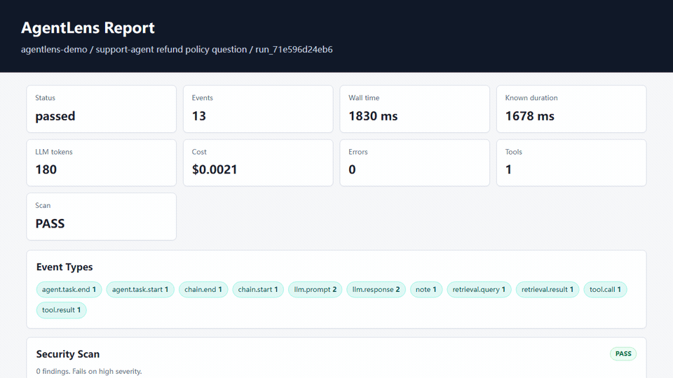
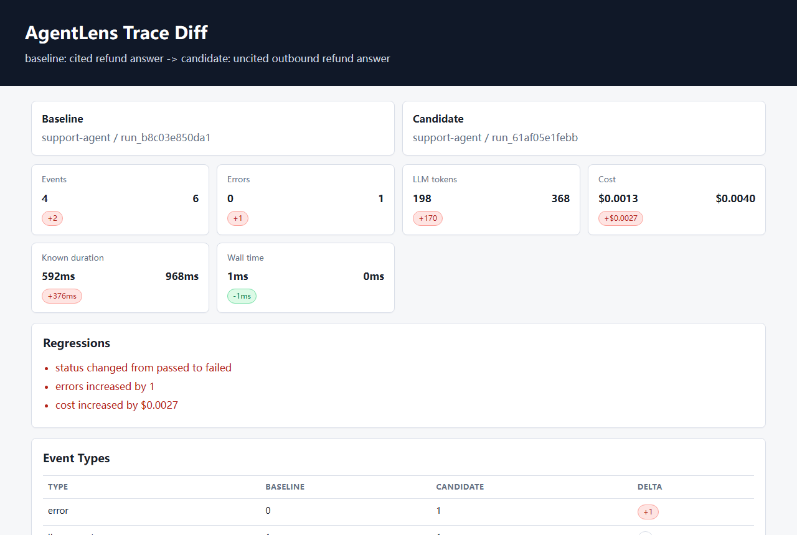
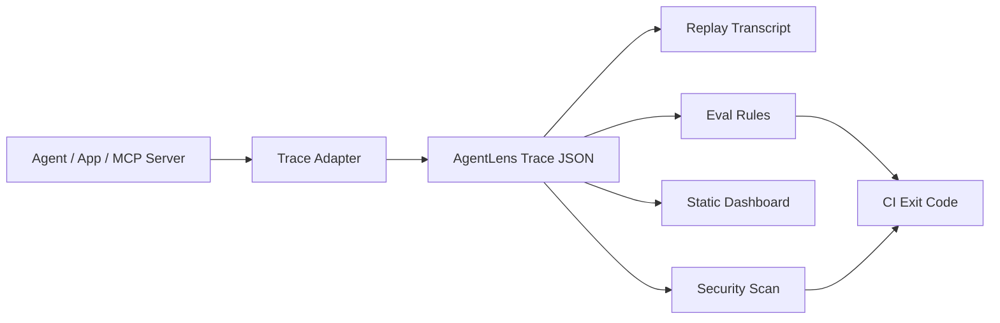

# AgentLens

Trace, replay, evaluate, and share AI agent runs before they break in production.

[](LICENSE)
[](package.json)
[](package.json)

AgentLens is a local-first DevTools stack for AI agents, multi-agent workflows, tool calls, RAG flows, and MCP-style integrations. It gives every run a readable trace, a deterministic replay transcript, JSON-based evals, and a static dashboard you can attach to issues or CI logs.

```text
agent run -> trace -> replay -> eval -> dashboard
```



Static screenshot: [dashboard-screenshot.png](docs/assets/dashboard-screenshot.png)

## PR Regression Review

AgentLens can turn recorded before/after agent runs into pull request artifacts: a CI summary, SARIF scan findings, a static diff dashboard, and a run bundle reviewers can open without rerunning the model.

```bash
npm run demo:regression-pr
```



## Why AgentLens

AI agents are easy to demo and hard to debug.

When an agent fails, teams usually lose time answering the same questions:

- What did the model see?
- Which tool did it call?
- What did retrieval return?
- Why did the final answer change?
- Did the run violate a cost, latency, safety, or citation rule?
- Can this failure be reproduced in CI?

AgentLens makes those questions inspectable with plain local files. No cloud account is required.

## What You Get

- Trace model for LLM prompts, responses, tool calls, retrieval, errors, usage, and metadata.
- Generic LLM wrapper for tracing model calls from any SDK.
- OpenAI-compatible and Anthropic-compatible provider adapter helpers.
- LangGraph-style node adapter for tracing graph-based agent steps.
- Multi-agent helpers with AutoGen-style and CrewAI-style runnable examples.
- Deterministic replay that reconstructs the timeline without calling a model again.
- Trace diff reports for before/after agent regressions.
- Static diff dashboards for sharing before/after regressions.
- Static run bundles for reviewing a directory of traces as a CI artifact.
- Runnable agent regression PR demo that emits CI summary, SARIF, diff dashboard, and run bundle artifacts.
- JSON output for inspect, eval, CI, and diff automation.
- Markdown CI summaries for GitHub Actions.
- PR comment Markdown output for GitHub review workflows.
- Upsert PR comment workflow using the stable `agentlens-ci-comment` marker.
- GitHub Action outputs for downstream workflow steps.
- Workspace doctor for checking local setup, traces, eval config, and CI wiring.
- Validation command for trace files and eval configs.
- Local security scan for secret leaks, prompt injection phrases, and high-risk tool calls.
- SARIF output for uploading agent trace scan findings to GitHub code scanning.
- Batch SARIF output from CI scan gates for run directories.
- Redacted share bundle generation for GitHub issues, PRs, and support threads.
- JSON eval rules for required events, forbidden tools, error budgets, cost budgets, latency budgets, and citation checks.
- MCP policy rules for server allowlists, required tool metadata, and forbidden tool permissions.
- MCP tool inventory and risk scanning.
- Zero-dependency stdio JSON-RPC MCP transport demo.
- MCP stdio trace sessions for reusing a server process across multiple tool calls.
- Static HTML dashboard with timeline filters and security scan findings for issues, PRs, and incident notes.
- Configurable dashboard sections for compact PR comments, support bundles, and focused trace reviews.
- Local dashboard server with JSON APIs and file-change refresh.
- Timeline filters for event type, status, search text, and MCP risk.
- Timeline jumps for errors, high-risk tool calls, final responses, and last events.
- Composite GitHub Action for failing PRs on agent eval regressions and scan findings.
- Zero runtime dependencies in the MVP.

## Quick Demo

```bash
node ./bin/agentlens.js init
node ./bin/agentlens.js doctor
node ./bin/agentlens.js demo --out .agentlens/runs/demo.json
node ./bin/agentlens.js inspect .agentlens/runs/demo.json
node ./bin/agentlens.js replay .agentlens/runs/demo.json
node ./bin/agentlens.js redact .agentlens/runs/demo.json --out .agentlens/runs/demo.redacted.json
node ./bin/agentlens.js share .agentlens/runs/demo.json --config .agentlens/evals/default.json --out .agentlens/share/demo --sections summary,timeline
node ./bin/agentlens.js eval .agentlens/runs/demo.json --config .agentlens/evals/default.json
node ./bin/agentlens.js scan .agentlens/runs/demo.json
node ./bin/agentlens.js validate trace .agentlens/runs/demo.json
node ./bin/agentlens.js validate eval .agentlens/evals/default.json
node ./bin/agentlens.js ci --runs .agentlens/runs --config .agentlens/evals/default.json --scan
node ./bin/agentlens.js ci --runs .agentlens/runs --config .agentlens/evals/default.json --scan --pr-comment-md .agentlens/reports/pr-comment.md
node ./bin/agentlens.js dashboard .agentlens/runs/demo.json --out .agentlens/reports/demo.html --sections summary,timeline
node ./bin/agentlens.js bundle .agentlens/runs --out .agentlens/reports/bundle --sections summary,timeline
node ./bin/agentlens.js serve .agentlens/runs --port 4317
npm run demo:regression-pr
```

`agentlens init` creates starter files under `.agentlens/`, including an editable eval config and a copyable GitHub Action example.

Want this in GitHub Actions?

```yaml
- name: Run AgentLens evals
  uses: cnqiujunhu-dev/agentlens@v0.2.0
  with:
    runs: .agentlens/runs
    config: evals/default.json
    scan-fail-on: high
```

Need schemas for editor or CI tooling?

```bash
node ./bin/agentlens.js schema trace
node ./bin/agentlens.js schema eval
```

Want to see eval failures?

```bash
npm run demo:fail
node ./bin/agentlens.js eval .agentlens/runs/failing-demo.json --config evals/default.json
```

Want to compare a regression against the healthy demo?

```bash
npm run demo
npm run diff:demo
npm run diff:dashboard
```

Want to wrap a generic LLM call?

```bash
npm run demo:llm
node ./bin/agentlens.js replay .agentlens/runs/llm-wrapper-demo.json
node ./bin/agentlens.js eval .agentlens/runs/llm-wrapper-demo.json --config evals/llm-basic.json
```

Want provider-style SDK adapters without adding SDK dependencies?

```bash
npm run demo:providers
node ./bin/agentlens.js replay .agentlens/runs/provider-adapters-demo.json
node ./bin/agentlens.js eval .agentlens/runs/provider-adapters-demo.json --config evals/llm-basic.json
```

Want to trace LangGraph-style node functions?

```bash
npm run demo:langgraph
node ./bin/agentlens.js replay .agentlens/runs/langgraph-style-demo.json
node ./bin/agentlens.js eval .agentlens/runs/langgraph-style-demo.json --config evals/langgraph-basic.json
```

Want to trace AutoGen-style or CrewAI-style multi-agent workflows?

```bash
npm run demo:autogen
node ./bin/agentlens.js replay .agentlens/runs/autogen-style-demo.json
node ./bin/agentlens.js eval .agentlens/runs/autogen-style-demo.json --config evals/multi-agent-basic.json
npm run demo:crewai
node ./bin/agentlens.js replay .agentlens/runs/crewai-style-demo.json
node ./bin/agentlens.js eval .agentlens/runs/crewai-style-demo.json --config evals/multi-agent-basic.json
```

Want to trace an MCP-style tool call?

```bash
npm run demo:mcp
node ./bin/agentlens.js replay .agentlens/runs/mcp-demo.json
node ./bin/agentlens.js eval .agentlens/runs/mcp-demo.json --config evals/mcp-policy.json
```

Want a real stdio JSON-RPC MCP transport demo?

```bash
npm run demo:mcp:stdio
node ./bin/agentlens.js replay .agentlens/runs/mcp-stdio-demo.json
node ./bin/agentlens.js eval .agentlens/runs/mcp-stdio-demo.json --config evals/mcp-policy.json
```

Need to reuse one MCP stdio server for multiple calls? Use `McpStdioTraceSession` from the JavaScript API.

Want append-friendly streaming traces?

```bash
npm run demo:jsonl
node ./bin/agentlens.js materialize .agentlens/runs/jsonl-demo.jsonl --out .agentlens/runs/jsonl-demo.json
```

Preparing launch screenshots or a demo recording?

```bash
npm run launch:demo
npm run release:gif
npm run bundle:demo
npm run share:demo
npm run release:audit
npm run release:preflight:local
```

This writes shareable traces, eval reports, and dashboards into `.agentlens/launch/`.

Sharing a trace publicly?

```bash
node ./bin/agentlens.js redact .agentlens/runs/demo.json --out .agentlens/runs/demo.redacted.json
node ./bin/agentlens.js scan .agentlens/runs/demo.redacted.json
```

Eval output:

```text
Eval: baseline-agent-quality
Status: PASS

[PASS] has-core-events: All required event types are present
[PASS] no-errors: Found 0 errors
[PASS] no-dangerous-tools: No forbidden tools were called
[PASS] tool-latency-budget: All tool results are within 3000ms
[PASS] cost-budget: Cost $0.0021 within budget
[PASS] has-final-answer: Final LLM response is present
[PASS] final-answer-has-citation: Final response has 2 citations
```

Replay output:

```text
01 [+  90ms] LLM PROMPT planner
02 [+ 770ms] LLM RESPONSE planner 680ms
03 [+ 840ms] TOOL CALL kb.search
04 [+1058ms] RETRIEVAL RESULT policy-search 148ms
05 [+1810ms] LLM RESPONSE final-answer 600ms
```

## How It Works



The MVP stores each run as a single JSON file:

```json
{
  "schemaVersion": "agentlens.trace.v1",
  "runId": "run_...",
  "app": "support-agent",
  "name": "refund policy question",
  "status": "passed",
  "events": [
    { "type": "llm.prompt" },
    { "type": "tool.call" },
    { "type": "tool.result" },
    { "type": "llm.response" }
  ]
}
```

## CLI

```text
agentlens init
agentlens doctor [--json]
agentlens demo [--out path]
agentlens inspect <trace-file> [--json]
agentlens replay <trace-file>
agentlens diff <baseline-trace> <candidate-trace> [--json]
agentlens diff-dashboard <baseline-trace> <candidate-trace> [--out path]
agentlens eval <trace-file> [--config path] [--json]
agentlens scan <trace-file> [--json] [--fail-on low|medium|high|critical|none] [--sarif path]
agentlens ci [--runs dir] [--config path] [--json] [--summary-md path] [--pr-comment-md path]
agentlens schema <trace|eval> [--out path]
agentlens validate <trace|eval> <file> [--json]
agentlens materialize <jsonl-file> [--out path]
agentlens redact <trace-file> [--out path] [--keys key1,key2]
agentlens share <trace-file> [--config path] [--out dir] [--keys key1,key2] [--sections summary,event-types,scan,filters,timeline]
agentlens dashboard <trace-file> [--out path] [--sections summary,event-types,scan,filters,timeline]
agentlens bundle [runs-dir] [--out dir] [--sections summary,event-types,scan,filters,timeline]
agentlens serve [trace-file|runs-dir] [--host host] [--port port]
```

## JavaScript API

```js
import { addEvent, createRun, evaluateTrace, finishRun, scanTrace, writeTrace } from "agentlens";

const run = createRun({ app: "support-agent", name: "refund question" });
addEvent(run, { type: "llm.prompt", name: "planner" });
addEvent(run, {
  type: "llm.response",
  name: "final-answer",
  output: { content: "Refunds are available within 30 days.", citations: ["refund-policy"] }
});
finishRun(run, "passed");
writeTrace(".agentlens/runs/refund.json", run);

const report = evaluateTrace(run, {
  name: "citation-policy",
  assertions: [{ id: "citations", type: "required-citations", min: 1 }]
});

const scan = scanTrace(run);
```

See [API.md](docs/API.md) for trace, eval, scan, JSONL, and MCP helper examples.

## Launch Materials

- [Launch plan](docs/LAUNCH_PLAN.md)
- [Launch copy](docs/LAUNCH_COPY.md)
- [Release checklist](docs/RELEASE_CHECKLIST.md)
- [Demo recording guide](docs/DEMO_RECORDING.md)
- [Launch post draft](docs/LAUNCH_POST.md)
- [Roadmap](docs/ROADMAP.md)
- [Agent regression PR example](docs/AGENT_REGRESSION_PR.md)
- [GitHub Action](docs/GITHUB_ACTION.md)
- [Run bundles](docs/RUN_BUNDLES.md)
- [Security scan](docs/SECURITY_SCAN.md)
- [MCP risk exceptions](docs/MCP_RISK_EXCEPTIONS.md)
- [LangGraph-style adapter](docs/LANGGRAPH_ADAPTER.md)
- [Multi-agent adapters](docs/MULTI_AGENT_ADAPTERS.md)
- [Changelog](CHANGELOG.md)
- [JSON schemas](docs/SCHEMAS.md)

Before publishing, run `npm run release:preflight` after configuring the GitHub remote and tagging the release. Use `npm run release:preflight:local` for local checks before the remote and tag exist.

## Community

- [Contributing](CONTRIBUTING.md)
- [Code of Conduct](CODE_OF_CONDUCT.md)
- [Support](SUPPORT.md)
- [Security](SECURITY.md)

## Eval Rules

Rules live in JSON so they can be reviewed, versioned, and run in CI.

```json
{
  "name": "baseline-agent-quality",
  "assertions": [
    {
      "id": "no-dangerous-tools",
      "type": "forbidden-tools",
      "tools": ["rm", "delete_database", "git.reset.hard"]
    },
    {
      "id": "final-answer-has-citation",
      "type": "required-citations",
      "min": 1
    }
  ]
}
```

## Security Scan

`agentlens scan` is a local heuristic pass for issues that are easy to miss in raw traces:

- secret-shaped values such as API keys, GitHub tokens, JWTs, and bearer tokens
- sensitive fields that were not redacted
- prompt injection phrases in prompt, retrieval, and response content
- declared or inferred high-risk tool calls

```bash
agentlens scan .agentlens/runs/demo.json
agentlens scan .agentlens/runs/demo.json --fail-on medium
agentlens scan .agentlens/runs/demo.json --json
agentlens scan .agentlens/runs/demo.json --sarif .agentlens/reports/agentlens-scan.sarif
agentlens ci --runs .agentlens/runs --config evals/default.json --scan --scan-fail-on high
agentlens ci --runs .agentlens/runs --config evals/default.json --scan --scan-fail-on none --sarif .agentlens/reports/agentlens-ci.sarif
```

The default threshold fails on `high` and `critical` findings. Medium findings, such as prompt-injection phrases, are reported as warnings unless you opt into `--fail-on medium`. CI can run the same scan with `--scan --scan-fail-on high`. Use `--sarif` on `scan` for one trace or on `ci --scan` for a run directory when you want GitHub code scanning or another SARIF consumer to ingest trace findings. Static dashboards include a Security Scan panel, and share bundles include `scan.txt` generated from the redacted trace.

## Use Cases

- Debug tool-using AI agents.
- Trace model calls without binding to one LLM SDK.
- Trace LangGraph-style node functions without adding a framework dependency.
- Trace AutoGen-style and CrewAI-style multi-agent workflows without adding framework dependencies.
- Compare before/after traces when an agent regresses.
- Share before/after trace diff dashboards in issues and PRs.
- Generate PR review artifacts for agent regressions.
- Emit JSON reports for CI bots, scripts, and PR comments.
- Add Markdown summaries to GitHub Actions runs.
- Generate stable PR comment Markdown for trace regression reviews.
- Feed GitHub Action status outputs into comments, notifications, or artifacts.
- Wrap OpenAI-compatible and Anthropic-compatible SDK calls.
- Reproduce flaky agent failures.
- Review RAG evidence and citation behavior.
- Add eval checks to CI.
- Scan traces for secret leaks, prompt injection text, and risky tool calls.
- Upload trace scan findings as SARIF for security dashboards.
- Export combined SARIF from CI scan gates for all traces in a run directory.
- Trace MCP-style tool calls.
- Trace real stdio MCP JSON-RPC tool calls.
- Reuse MCP stdio trace sessions across multiple tool calls.
- Enforce MCP server and permission policies.
- Scan MCP tool schemas for risky capabilities.
- Review explicit exceptions for approved risky MCP tools.
- Require owner and expiry metadata for MCP risk exceptions.
- Stream long-running traces as JSONL.
- Redact secrets before sharing traces.
- Generate a redacted share bundle for support threads.
- Publish JSON Schemas for external tooling.
- Validate trace and eval files before sharing or running CI.
- Browse local runs with a zero-dependency dashboard server.
- Generate static run bundles for CI artifacts and support handoffs.
- Poll local trace files while agents are running.
- Filter long traces by event type, status, text, and MCP risk.
- Jump directly to the first error, first high-risk call, final response, or last event in long traces.
- Render compact dashboard sections for PR comments, incident notes, and support handoffs.
- Start with editable init scaffolding for evals and CI examples.
- Fail GitHub PRs when recorded agent runs violate eval rules or scan gates.
- Generate launch-ready demo artifacts.
- Check local AgentLens setup with `agentlens doctor`.
- Share compact run reports in GitHub issues.
- Build policy packs for MCP servers and internal tools.

## Roadmap

See [ROADMAP.md](docs/ROADMAP.md) for release status, integration milestones, good first issues, and non-goals.

- Unit tests, CI batch eval, failure-case demo, MCP adapter MVP, and MCP policy rules.
- Public JavaScript API and package exports.
- Trace redaction CLI and API.
- Local security scan CLI and API.
- Trace/Eval JSON Schemas.
- Trace diff CLI and API.
- Static trace diff dashboards.
- Static run bundle indexes.
- Runnable agent regression PR artifact generator.
- JSON report output for automation.
- GitHub Actions Markdown summaries.
- GitHub PR comment Markdown renderer.
- Init scaffolding for starter evals and GitHub Action examples.
- Generic LLM call adapter.
- LangGraph-style node adapter.
- Multi-agent adapter helpers and AutoGen-style/CrewAI-style examples.
- Local dashboard server.
- GitHub Action for agent regression tests.
- MCP tool inventory and risk scanner.
- MCP stdio trace sessions.
- Live local dashboard refresh.
- Dashboard timeline filters.
- Dashboard timeline jumps.
- Configurable dashboard sections.
- Reviewed MCP risk exceptions.
- Owner and expiry checks for MCP risk exceptions.
- Launch demo artifact generator.
- JavaScript SDK wrapper for common LLM calls.
- Deeper AutoGen and CrewAI integration notes.
- Richer dashboards for MCP exception review history.
- VS Code extension.
- JSONL streaming trace reader and writer.

## Project Philosophy

AgentLens is not another agent framework.

It is the missing engineering layer around agent frameworks: trace, replay, eval, and governance.

## Status

Early MVP. The current version is useful for local traces, deterministic replay, JSON evals, security scans, share bundles, CI checks, static dashboard reports, and zero-dependency multi-agent examples. The next milestone is deeper framework adapters and richer governance reports.
