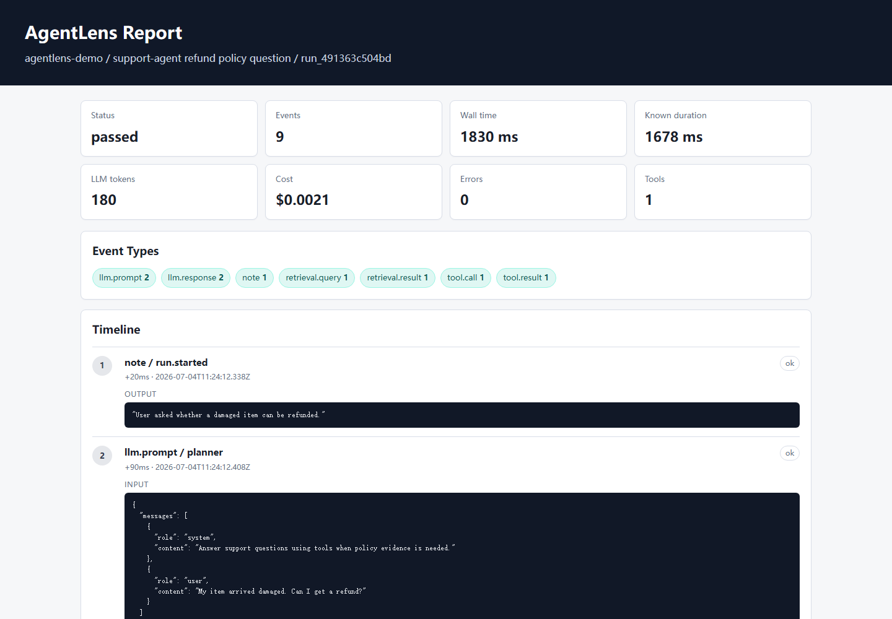
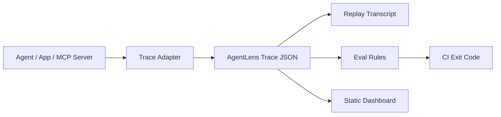

# AgentLens

Trace, replay, evaluate, and share AI agent runs before they break in production.

[](LICENSE)
[](package.json)
[](package.json)

AgentLens is a local-first DevTools stack for AI agents, tool calls, RAG flows, and MCP-style integrations. It gives every run a readable trace, a deterministic replay transcript, JSON-based evals, and a static dashboard you can attach to issues or CI logs.

```text
agent run -> trace -> replay -> eval -> dashboard
```



## Why AgentLens

AI agents are easy to demo and hard to debug.

When an agent fails, teams usually lose time answering the same questions:

- What did the model see?
- Which tool did it call?
- What did retrieval return?
- Why did the final answer change?
- Did the run violate a cost, latency, safety, or citation rule?
- Can this failure be reproduced in CI?

AgentLens makes those questions inspectable with plain local files. No cloud account is required.

## What You Get

- Trace model for LLM prompts, responses, tool calls, retrieval, errors, usage, and metadata.
- Generic LLM wrapper for tracing model calls from any SDK.
- OpenAI-compatible and Anthropic-compatible provider adapter helpers.
- Deterministic replay that reconstructs the timeline without calling a model again.
- Trace diff reports for before/after agent regressions.
- JSON eval rules for required events, forbidden tools, error budgets, cost budgets, latency budgets, and citation checks.
- MCP policy rules for server allowlists, required tool metadata, and forbidden tool permissions.
- MCP tool inventory and risk scanning.
- Zero-dependency stdio JSON-RPC MCP transport demo.
- Static HTML dashboard for sharing runs in GitHub issues, PRs, and incident notes.
- Local dashboard server with JSON APIs and file-change refresh.
- Timeline filters for event type, status, search text, and MCP risk.
- Composite GitHub Action for failing PRs on agent eval regressions.
- Zero runtime dependencies in the MVP.

## Quick Demo

```bash
node ./bin/agentlens.js init
node ./bin/agentlens.js demo --out .agentlens/runs/demo.json
node ./bin/agentlens.js inspect .agentlens/runs/demo.json
node ./bin/agentlens.js replay .agentlens/runs/demo.json
node ./bin/agentlens.js redact .agentlens/runs/demo.json --out .agentlens/runs/demo.redacted.json
node ./bin/agentlens.js eval .agentlens/runs/demo.json --config .agentlens/evals/default.json
node ./bin/agentlens.js ci --runs .agentlens/runs --config .agentlens/evals/default.json
node ./bin/agentlens.js dashboard .agentlens/runs/demo.json --out .agentlens/reports/demo.html
node ./bin/agentlens.js serve .agentlens/runs --port 4317
```

`agentlens init` creates starter files under `.agentlens/`, including an editable eval config and a copyable GitHub Action example.

Want this in GitHub Actions?

```yaml
- name: Run AgentLens evals
  uses: your-org/agentlens@v0
  with:
    runs: .agentlens/runs
    config: evals/default.json
```

Need schemas for editor or CI tooling?

```bash
node ./bin/agentlens.js schema trace
node ./bin/agentlens.js schema eval
```

Want to see eval failures?

```bash
npm run demo:fail
node ./bin/agentlens.js eval .agentlens/runs/failing-demo.json --config evals/default.json
```

Want to compare a regression against the healthy demo?

```bash
npm run demo
npm run diff:demo
```

Want to wrap a generic LLM call?

```bash
npm run demo:llm
node ./bin/agentlens.js replay .agentlens/runs/llm-wrapper-demo.json
node ./bin/agentlens.js eval .agentlens/runs/llm-wrapper-demo.json --config evals/llm-basic.json
```

Want provider-style SDK adapters without adding SDK dependencies?

```bash
npm run demo:providers
node ./bin/agentlens.js replay .agentlens/runs/provider-adapters-demo.json
node ./bin/agentlens.js eval .agentlens/runs/provider-adapters-demo.json --config evals/llm-basic.json
```

Want to trace an MCP-style tool call?

```bash
npm run demo:mcp
node ./bin/agentlens.js replay .agentlens/runs/mcp-demo.json
node ./bin/agentlens.js eval .agentlens/runs/mcp-demo.json --config evals/mcp-policy.json
```

Want a real stdio JSON-RPC MCP transport demo?

```bash
npm run demo:mcp:stdio
node ./bin/agentlens.js replay .agentlens/runs/mcp-stdio-demo.json
node ./bin/agentlens.js eval .agentlens/runs/mcp-stdio-demo.json --config evals/mcp-policy.json
```

Want append-friendly streaming traces?

```bash
npm run demo:jsonl
node ./bin/agentlens.js materialize .agentlens/runs/jsonl-demo.jsonl --out .agentlens/runs/jsonl-demo.json
```

Preparing launch screenshots or a demo recording?

```bash
npm run launch:demo
npm run release:audit
```

This writes shareable traces, eval reports, and dashboards into `.agentlens/launch/`.

Sharing a trace publicly?

```bash
node ./bin/agentlens.js redact .agentlens/runs/demo.json --out .agentlens/runs/demo.redacted.json
```

Eval output:

```text
Eval: baseline-agent-quality
Status: PASS

[PASS] has-core-events: All required event types are present
[PASS] no-errors: Found 0 errors
[PASS] no-dangerous-tools: No forbidden tools were called
[PASS] tool-latency-budget: All tool results are within 3000ms
[PASS] cost-budget: Cost $0.0021 within budget
[PASS] has-final-answer: Final LLM response is present
[PASS] final-answer-has-citation: Final response has 2 citations
```

Replay output:

```text
01 [+  90ms] LLM PROMPT planner
02 [+ 770ms] LLM RESPONSE planner 680ms
03 [+ 840ms] TOOL CALL kb.search
04 [+1058ms] RETRIEVAL RESULT policy-search 148ms
05 [+1810ms] LLM RESPONSE final-answer 600ms
```

## How It Works



The MVP stores each run as a single JSON file:

```json
{
  "schemaVersion": "agentlens.trace.v1",
  "runId": "run_...",
  "app": "support-agent",
  "name": "refund policy question",
  "status": "passed",
  "events": [
    { "type": "llm.prompt" },
    { "type": "tool.call" },
    { "type": "tool.result" },
    { "type": "llm.response" }
  ]
}
```

## CLI

```text
agentlens init
agentlens demo [--out path]
agentlens inspect <trace-file>
agentlens replay <trace-file>
agentlens diff <baseline-trace> <candidate-trace>
agentlens eval <trace-file> [--config path]
agentlens ci [--runs dir] [--config path]
agentlens schema <trace|eval> [--out path]
agentlens materialize <jsonl-file> [--out path]
agentlens redact <trace-file> [--out path] [--keys key1,key2]
agentlens dashboard <trace-file> [--out path]
agentlens serve [trace-file|runs-dir] [--host host] [--port port]
```

## JavaScript API

```js
import { addEvent, createRun, evaluateTrace, finishRun, writeTrace } from "agentlens";

const run = createRun({ app: "support-agent", name: "refund question" });
addEvent(run, { type: "llm.prompt", name: "planner" });
addEvent(run, {
  type: "llm.response",
  name: "final-answer",
  output: { content: "Refunds are available within 30 days.", citations: ["refund-policy"] }
});
finishRun(run, "passed");
writeTrace(".agentlens/runs/refund.json", run);

const report = evaluateTrace(run, {
  name: "citation-policy",
  assertions: [{ id: "citations", type: "required-citations", min: 1 }]
});
```

See [API.md](docs/API.md) for trace, eval, JSONL, and MCP helper examples.

## Launch Materials

- [Launch plan](docs/LAUNCH_PLAN.md)
- [Launch copy](docs/LAUNCH_COPY.md)
- [GitHub Action](docs/GITHUB_ACTION.md)
- [Changelog](CHANGELOG.md)
- [JSON schemas](docs/SCHEMAS.md)

## Eval Rules

Rules live in JSON so they can be reviewed, versioned, and run in CI.

```json
{
  "name": "baseline-agent-quality",
  "assertions": [
    {
      "id": "no-dangerous-tools",
      "type": "forbidden-tools",
      "tools": ["rm", "delete_database", "git.reset.hard"]
    },
    {
      "id": "final-answer-has-citation",
      "type": "required-citations",
      "min": 1
    }
  ]
}
```

## Use Cases

- Debug tool-using AI agents.
- Trace model calls without binding to one LLM SDK.
- Compare before/after traces when an agent regresses.
- Wrap OpenAI-compatible and Anthropic-compatible SDK calls.
- Reproduce flaky agent failures.
- Review RAG evidence and citation behavior.
- Add eval checks to CI.
- Trace MCP-style tool calls.
- Trace real stdio MCP JSON-RPC tool calls.
- Enforce MCP server and permission policies.
- Scan MCP tool schemas for risky capabilities.
- Review explicit exceptions for approved risky MCP tools.
- Stream long-running traces as JSONL.
- Redact secrets before sharing traces.
- Publish JSON Schemas for external tooling.
- Browse local runs with a zero-dependency dashboard server.
- Poll local trace files while agents are running.
- Filter long traces by event type, status, text, and MCP risk.
- Start with editable init scaffolding for evals and CI examples.
- Fail GitHub PRs when recorded agent runs violate eval rules.
- Generate launch-ready demo artifacts.
- Share compact run reports in GitHub issues.
- Build policy packs for MCP servers and internal tools.

## Roadmap

- Unit tests, CI batch eval, failure-case demo, MCP adapter MVP, and MCP policy rules.
- Public JavaScript API and package exports.
- Trace redaction CLI and API.
- Trace/Eval JSON Schemas.
- Trace diff CLI and API.
- Init scaffolding for starter evals and GitHub Action examples.
- Generic LLM call adapter.
- Local dashboard server.
- GitHub Action for agent regression tests.
- MCP tool inventory and risk scanner.
- Live local dashboard refresh.
- Dashboard timeline filters.
- Reviewed MCP risk exceptions.
- Launch demo artifact generator.
- JavaScript SDK wrapper for common LLM calls.
- LangGraph, AutoGen, and CrewAI adapter examples.
- Expiring owners for reviewed MCP risk exceptions.
- VS Code extension.
- JSONL streaming trace reader and writer.

## Project Philosophy

AgentLens is not another agent framework.

It is the missing engineering layer around agent frameworks: trace, replay, eval, and governance.

## Status

Early MVP. The current version is useful for local traces, deterministic replay, JSON evals, and static dashboard reports. The next milestone is framework adapters and CI packaging.
